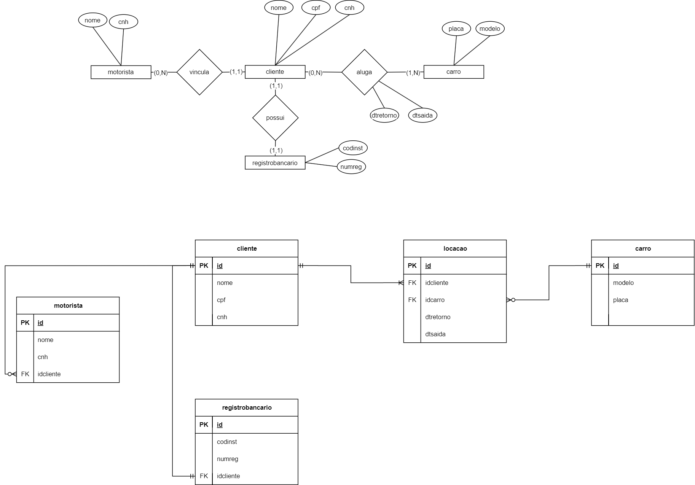

# Modelagem de Dados

Projeto de exemplo usando modelagem conceitual e Modelo Relacional implantado no `Postgres`

* No exemplo da locadora é usado o seguinte modelo

### Fontes
Para pesquisas mais aprofundadas:

* [Postgres](https://www.postgresql.org/)
* [DBeaver](https://dbeaver.io/download/)
* [DRAW.IO](https://app.diagrams.net/)
* [Dicas](https://docs.google.com/document/d/1FY3AmaJCffd6L3JkVRXXedRj4pEgiLgjjntpT_pIvMw/view)

## Vídeo 01

[LINK](LINK)

